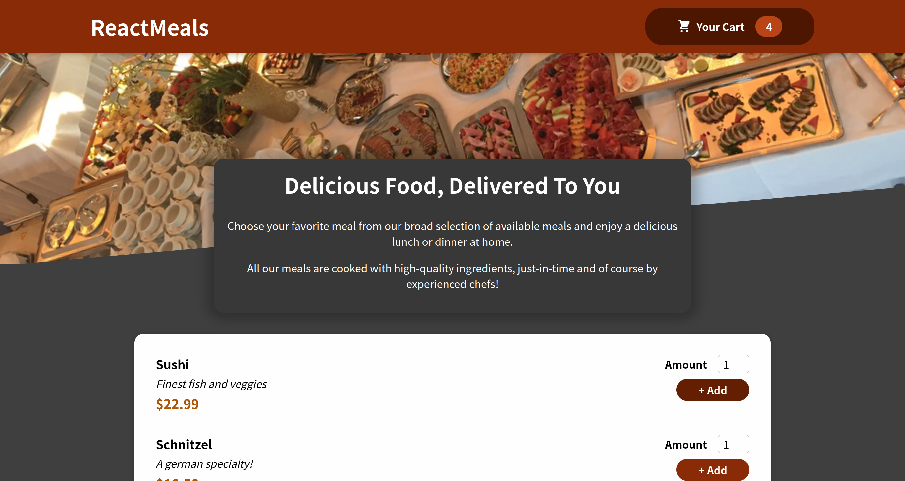
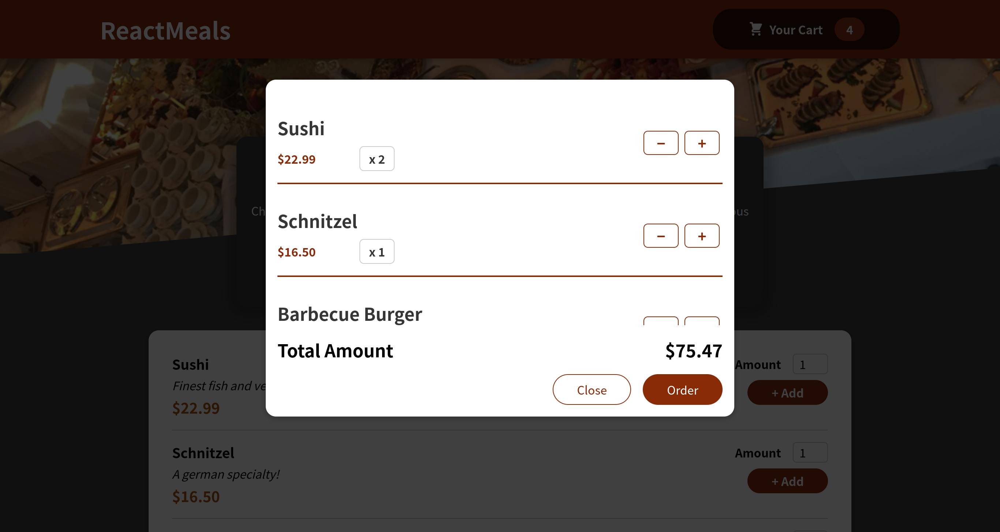

# Food Order App

Esse projeto foi desenvolvido visando revisar e aplicar conceitos aprendidos sobre ReactJS.

Você pode conferir o resultado [clicando aqui!](https://dedecanton.github.io/expense-tracker/)

- Conhecimentos aprimorados
    - HTML
    - CSS
    - JavaScript
    - ReactJS
    - ContextAPI
    - Git
    - Consumo de API
    - React Portals

- Imagens

